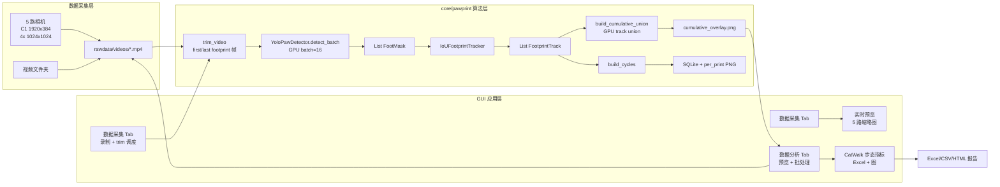

# DeepGait v3 算法流程图索引

> 协作画布：用 Obsidian 打开 `deepgait-v3/` 文件夹，直接编辑本目录下的 ` ```mermaid ` 代码块，Obsidian 会实时渲染。
>
> 节点标签含 `[` `(` `*` 等特殊字符时，必须用 **双引号** 包裹整行，否则 Mermaid 解析失败。

## 跨模块数据流



## 流程图清单

### 核心算法层 — `core/pawprint/`

| 文件 | 模块 | 关键函数 |
|------|------|---------|
| [yolo-detector.md](yolo-detector.md) | YOLOv8n-seg 分割 | `detect_single` / `detect_batch` |
| [iou-tracker.md](iou-tracker.md) | IoU 跨帧关联 | `update` / `finalize` |
| [cumulative-union.md](cumulative-union.md) | GPU track-level union | `build_cumulative_union` |
| [video-trim.md](video-trim.md) | 视频去头掐尾 | `trim_video` / `find_trim_range` |
| [stage1-pipeline.md](stage1-pipeline.md) | 整条 trial 流水线 | `Stage1Pipeline.run` |
| [cycle-builder.md](cycle-builder.md) | track 转 FootprintCycle | `build_cycles` |
| [mouse-detector.md](mouse-detector.md) | 鼠体 ROI 检测 | `MouseDetector.__call__` |

### GUI 应用层 — `gui/`

| 文件 | 模块 | 关键类 |
|------|------|-------|
| [data-acquisition-tab.md](data-acquisition-tab.md) | 数据采集 tab（原新建实验） | `GaitExperimentTab` |
| [data-analysis-tab.md](data-analysis-tab.md) | 数据分析 tab | `GaitAnalysisTab` |
| [background-workers.md](background-workers.md) | QThread 后台工人 | `TrimWorker` / `BatchAnalysisWorker` |

### 硬件抽象层 — `hardware/`

| 文件 | 模块 | 关键类 |
|------|------|-------|
| [multi-camera-sync.md](multi-camera-sync.md) | 多相机硬件同步 | `MultiCameraManager` / `TriggerController` |

## 命名约定

- 文件名：kebab-case，对应模块名去掉 `deepgait3/` 前缀和 `.py` 后缀。
- 节点标签：动作加目标，例如 `批推理 YOLOv8`。
- 决策节点：菱形 `{...}`，带"是/否"标注。
- 循环：使用 `subgraph` 包裹，加 `style ... fill:#f9f`。
