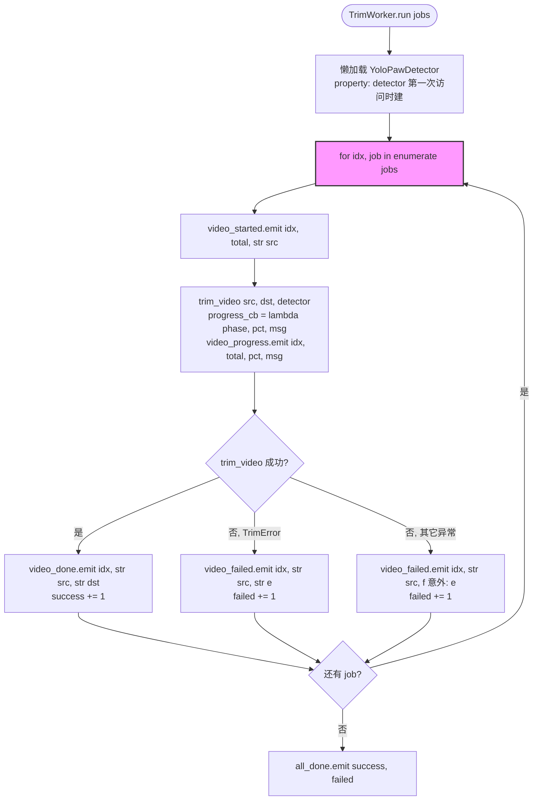
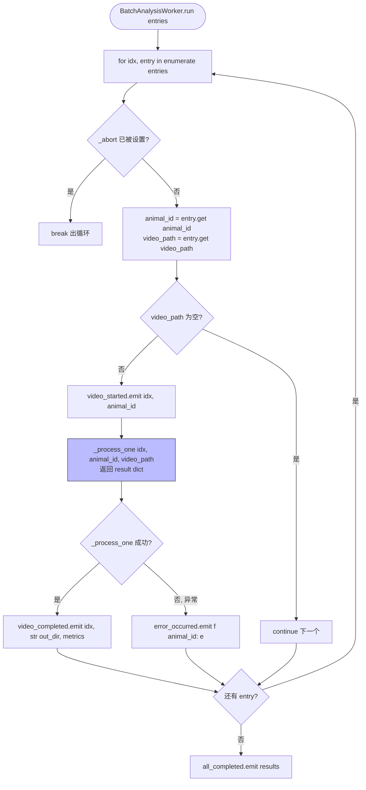
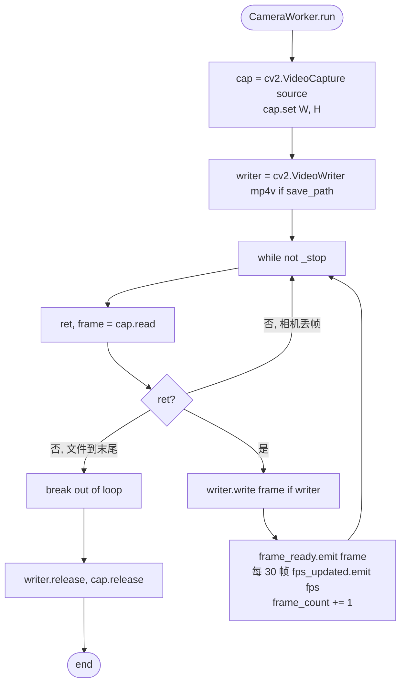

# QThread 后台工人

文件：`deepgait3/gui/workers.py`

> 所有后台线程统一用 `QThread` + `Signal` 模式。worker 与 GUI 通过信号槽解耦，UI 永远只发信号、不阻塞等结果。

## Worker 列表

| 类 | 用途 | 主信号 |
|---|---|---|
| `GaitWorker` | legacy 步态分析 | `result_ready(object)` / `progress(str)` / `error(str)` |
| `FTIRWorker` | 单帧 pawprint 预览 | `result_ready(list)` / `progress(str)` / `error(str)` |
| `DLCWorker` | DeepLabCut 子流程 | `step_done(str)` / `progress(str)` / `error(str)` |
| `CameraWorker` | 单相机/视频源抓帧 | `frame_ready(ndarray)` / `fps_updated(float)` / `error(str)` |
| `TrimWorker` | 多视频 trim 调度 | `video_started` / `video_progress` / `video_done` / `video_failed` / `all_done` |
| `BatchAnalysisWorker` | 批分析 | `video_started` / `video_progress` / `video_completed` / `all_completed` / `error_occurred` |

## TrimWorker 流程（数据采集 tab 主用）

## BatchAnalysisWorker 流程（数据分析 tab 主用）

## CameraWorker 流程（数据采集 tab 备选）

## 关键点

- **统一 `QThread + Signal` 模式**：与 Qt 主线程天然兼容，自动 join 不会泄露。
- **`try/except` 包裹整个 `run`**：单个 job 失败不会拖死整个 worker。
- **懒加载 detector**：`TrimWorker.detector` 是 property，第一次访问时建一次，后续复用。
- **跨平台摄像头**：[multi-camera-sync.md](multi-camera-sync.md) 是更复杂的多相机硬件同步方案。
- **GUI 端消费**：[data-acquisition-tab.md](data-acquisition-tab.md) 连接 `TrimWorker` 的 5 个信号；[data-analysis-tab.md](data-analysis-tab.md) 连接 `BatchAnalysisWorker` 的 5 个信号。
