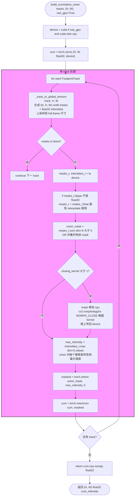
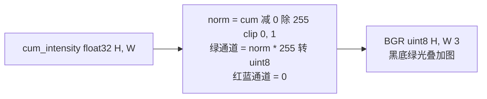

# GPU 累积图 — Track-level Union Mask

文件：`deepgait3/core/pawprint/cumulative.py`

**核心 API**：
- `build_cumulative_union(tracks, (H, W), *, closing_kernel=None, use_gpu=True)` — 返回 `(H, W) float32` 累积图
- `build_cumulative_union_cpu(tracks, (H, W), *, closing_kernel=None)` — CPU 回退
- `render_overlay(cum_intensity)` — 返回黑底绿光 `uint8` BGR 图
- `_track_to_global_tensors(track, H, W)` — 把单个 track 的所有帧 mask 投影到全帧并上采样

### 渲染（`render_overlay`）

## 关键点

- **空间维度**：每个 track 的 union mask = 所有帧 mask 的 OR，**先聚合再取强度**，比像素级 max-merge 干净。
- **强度维度**：union mask 内每个像素取该 track 全部帧中的最大强度。
- **可选闭运算**：`closing_kernel > 1` 时用椭圆 kernel 做 MORPH_CLOSE，连上"脚掌-脚趾"之间的间隙。
- **GPU 加速**：所有 per-track tensor 操作都在 GPU 上；mask→numpy 上传和 (可选) 闭运算是 CPU。
- **dtype 修复**：`if masks_t.dtype != float32: masks_t = masks_t.float()` — 防止 `torch.nn.functional.interpolate` 报 "NotImplementedError for Byte"。
- **CPU 回退**：`use_gpu=False` 时自动用 numpy 路径（`build_cumulative_union_cpu`）。
- **零 Qt 依赖**，纯算法层，可 CLI 直接调用。
- **三个调用点已统一**：`core/pawprint/pipeline.py:_save_cumulative`、`experiment/demo_video_gpu.py`、`gui/gait_analysis_tab.py`（预览合并）。
