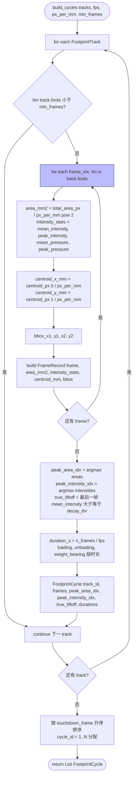

# Track → FootprintCycle 装配

文件：`deepgait3/core/pawprint/cycle_builder.py`

**核心 API**：
- `build_cycles(tracks, fps, px_per_mm, min_frames=2) -> List[FootprintCycle]`
- 输出按 touchdown_frame 升序，cycle_id 从 1 开始递增

## 关键点

- **每个 track → 一个 cycle 候选**：track 内部所有帧聚合成一个脚印事件。
- **最短帧数过滤** `min_frames=2`：单帧的 track 被丢弃，避免噪声。
- **三段时间分解**：duration 拆成 loading / weight_bearing / unloading 三段，便于后续 CatWalk 步态分析。
- **true_liftoff**：用 mean_intensity 阈值判定"真正离地"瞬间，区别于"已离开但背景未稳定"。
- **物理单位换算**：`px / px_per_mm` 得到 mm 物理距离；`px² / px_per_mm²` 得到 mm² 物理面积。
- **cycle_id 不包含 paw 身份**：本步骤只做时间排序，paw_id 由 Stage 2 (`pose3d`) 注入。
- **数据契约**：`FootprintCycle` 字段定义在 `core/pawprint/models.py`，与 Stage 1 → Stage 2/3/4 的数据流一致。
- **零 Qt 依赖**，纯算法层。
