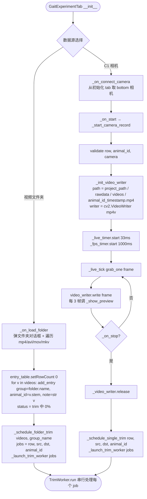
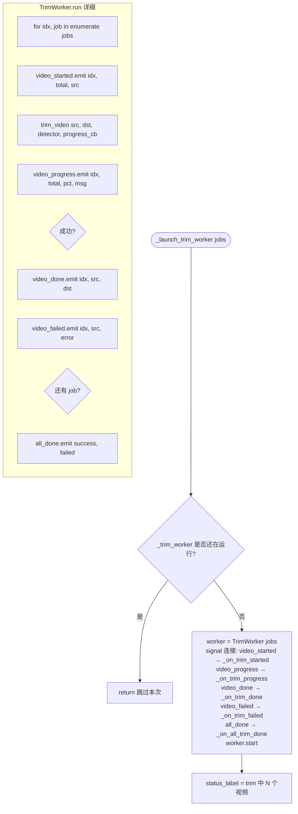

# 数据采集 Tab（原"新建实验"）

文件：`deepgait3/gui/gait_experiment_tab.py`

> **本 tab 重命名时间**：2026-07-08 计划将"新建实验" → "数据采集"。本 tab 职责是"把 raw video 拿进项目"，**不再做累积图渲染**（累积图已迁到[数据分析 Tab](data-analysis-tab.md)）。

**核心组件**：
- `ExperimentEntryTable(4列：组别 / 动物编号 / 状态 / 备注)`
- `GaitExperimentTab` — 录制 + trim 调度
- 内部状态：`_camera`, `_video_writer`, `_trim_worker`, `_trim_jobs`

## 状态机总览

## TrimWorker 串行调度细节

## UI 状态映射

| 阶段 | 状态列文字 |
|---|---|
| 刚录入 | `待录制` |
| 录制中 | `采集中...` |
| 录制完等待 trim | `trim 中...` |
| Trim 中带进度 | `trim 中 (1/3, 45%)` |
| Trim 完成 | `完成 /abs/path/.../trimmed/C57-001.mp4` |
| Trim 失败 | `trim 失败: <error>` |

## 关键点

- **路径修复**：从 `videos/` 改为 `project_path / "rawdata" / "videos"`，与 v3 项目布局一致。
- **串行 Trim**：单 GPU 一次只跑一个 trim，避免显存竞争。
- **C1 相机模式**：仅录制原始视频 + 实时预览原视频，**不做累积图**（GUI 性能 + 算法独立原则）。
- **文件夹模式**：自动用文件夹名当组别、视频文件名当动物编号。
- **TrimWorker 在 QThread 跑**，[详细流程见 background-workers.md](background-workers.md)。
- **提示**："注：累积脚印图渲染请到「数据分析」tab"
- **trim 算法**：[video-trim.md](video-trim.md)
