# 数据分析 Tab

文件：`deepgait3/gui/gait_analysis_tab.py`

> **职责**：项目内 trimmed 视频的预览 + 参数微调 + 批量步态分析，输出 CatWalk 等价指标。

**核心组件**：
- `BatchAnalysisWorker(QThread)` — 串行处理每个视频，调用 pawprint detection + legacy 步态指标
- `GaitAnalysisTab` — UI，含视频列表表、参数微调面板、视频/脚印预览、批处理控制

## 总流程

```mermaid
flowchart TD
    Start(["GaitAnalysisTab"]) --> LoadVideos["_on_load_project_videos\nor _on_add_video 或 _on_delete_video"]
    LoadVideos --> SelectRow{"用户在 batch_table 选中一行?"}
    SelectRow -->|"否"| Stop["提示选择视频"]
    SelectRow -->|"是"| PreviewBtn{"点 开始采集?"}
    PreviewBtn -->|"是"| Preview["_on_preview_video\n打开 cv2.VideoCapture\n创建 RollingMedianBackground, IoUFootprintTracker\n_preview_timer.start 33ms"]
    Preview --> Tick["_preview_tick 每 33ms"]
    Tick --> ReadFrame["ret, frame = cap.read\nbg.update frame"]
    ReadFrame --> Axis{"累积质心 大于等于 6?"}
    Axis -->|"是"| PCA["_estimate_body_axis\nnp.linalg.svd 求主方向"]
    Axis -->|"否"| Default["body_axis = 横向默认"]
    PCA --> Det["bg_med = bg.get_median\nbg_G = 绿色通道\ndetect_single_frame frame, bg_G, min_area_px"]
    Default --> Det
    Det --> Accum["_update_footprint frame, footmasks\nnp.maximum 写入 _preview_accum"]
    Accum --> TrkUpdate["_preview_tracker.update frame_count, footmasks"]
    TrkUpdate --> Show{"frame_count mod 3 == 0?"}
    Show -->|"是"| ShowPV["_show_preview + _show_footprint"]
    Show -->|"否"| Next
    ShowPV --> Next["_preview_count += 1"]
    Next --> EndCheck{"ret 为 False?"}
    EndCheck -->|"否"| Tick
    EndCheck -->|"是"| StopPreview["_on_stop_preview\n释放 cap, 停止 timer"]
    StopPreview --> BatchBtn

    PreviewBtn -->|"否"| BatchBtn{"点 视频分析?"}
    BatchBtn -->|"否"| Idle["就绪"]
    BatchBtn -->|"是"| Collect["_collect_entries\n遍历 batch_table 收集 animal_id, video_path"]
    Collect --> Worker["BatchAnalysisWorker entries, base_dir, tau_paw, min_area_px, px_per_mm\n连接 4 个 signal\nworker.start"]

    subgraph BatchWorker["BatchAnalysisWorker.run 详细"]
        LoopW["for idx, entry in enumerate entries"]
        StartedW["video_started.emit idx, animal_id"]
        OpenCap["cap = cv2.VideoCapture\nfps, total_frames, h, w = props"]
        LoopFrame["while not _abort: ret, frame = cap.read\nbg.update frame"]
        DetW["detect_single_frame frame, bg_G, min_area_px\n累积 in_stance, intensity, centroids, area, pressure"]
        EmitProg["每 10 帧 video_progress.emit idx, fi, total_frames"]
        NextVidW{"还有 frame?"}
        Metrics["compute_catwalk_equivalent_metrics\ncompute_per_paw_pressure_aggregates\nclassify_step_sequence + compute_regularity_index\ncompute_bos + compute_support_patterns\ncompute_per_step_metrics\nbuild_per_frame_pressure"]
        Export["gait_export.export_all out_dir, animal_id, metrics, all_steps, pressure_rows, ..."]
        CompletedW["video_completed.emit idx, out_dir, metrics"]
        AllComp["all_completed.emit results"]
    end
```

## 参数微调面板

| 控件 | 范围/默认 | 作用 |
|---|---|---|
| `tau_spin` | 1–80, 默认 10 | 绿色亮度阈值（pawprint detection） |
| `paw_spin` | 2–600, 默认 10 | 最小爪印面积 |
| `brightness_spin` | 0.5–3.0, 默认 1.0 | 累积图显示亮度倍率 |

## 关键点

- **预览逻辑复用 pawprint detection**：`detect_single_frame` 单帧 GPU 推理。
- **累积图算法**：[cumulative-union.md](cumulative-union.md) 的 `build_cumulative_union` 在 `_show_footprint` 中以像素级 max-merge 形式（仅预览，不入正式数据）。
- **批处理走 CatWalk 兼容指标**：`gait_ftir.compute_catwalk_equivalent_metrics` 等 legacy 模块。
- **数据落点**：`output_base_dir = project_path / data / <animal_id> /`，由 `animal_data_dir` 决定。
- **`_abort` 标志**：用户点停止时通过 `QThread.abort()` 软中断当前帧。
- **预览器**：[cumulative-union.md](cumulative-union.md)、[yolo-detector.md](yolo-detector.md)
- **批处理算法**：Stage 1 → Stage 3 步态指标的拼装，主要路径由 legacy `_legacy` 模块承担
