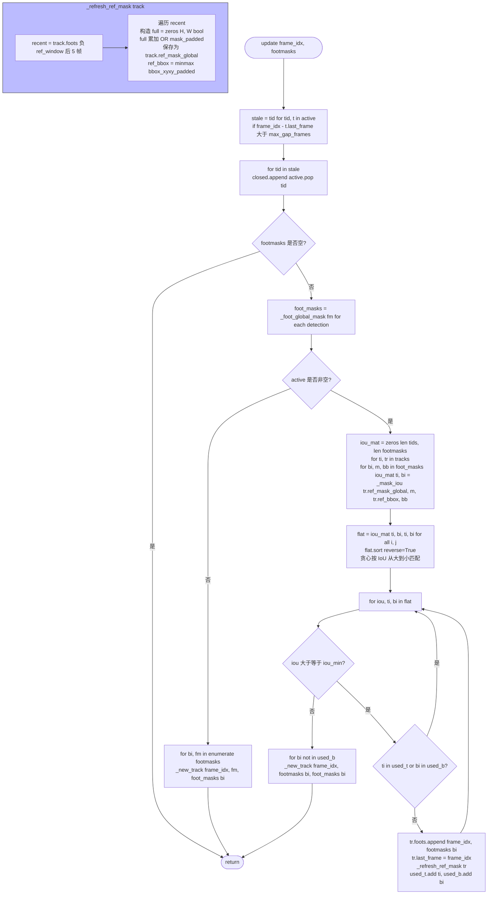

# IoU 爪印跟踪

文件：`deepgait3/core/pawprint/tracker.py`

**核心 API**：
- `FootprintTrack(track_id, foots=[(frame_idx, FootMask)], ref_mask_global, ref_bbox, last_frame)`
- `IoUFootprintTracker(frame_shape, iou_min=0.3, max_gap_frames=3, ref_window_frames=5)`
- `update(frame_idx, footmasks)` — 每帧调用一次
- `finalize()` — 处理完最后帧调用，返回所有 track 列表

## 关键点

- **贪心匹配**：按 IoU 从大到小，先解决高重叠对，再处理剩余 detection。
- **track 关闭条件**：当 `frame_idx - last_frame > max_gap_frames` 时被移入 `closed`。
- **ref_mask 滑窗**：只保留最近 5 帧的 union mask，**容忍慢形变**（如脚掌抬起/落下的轮廓变化）。
- **`_foot_global_mask`**：把 `mask_padded` 投影回全帧 `bool[H, W]`，便于跨帧 IoU 计算。
- **track 互斥**：一个 detection 只属于一个 track；已用过的 track/detection 跳过。
- **`finalize()`** 把 active 全部移入 closed，返回完整 track 列表。
- **零 GPU 依赖**，全部 CPU numpy，<1ms/帧。
