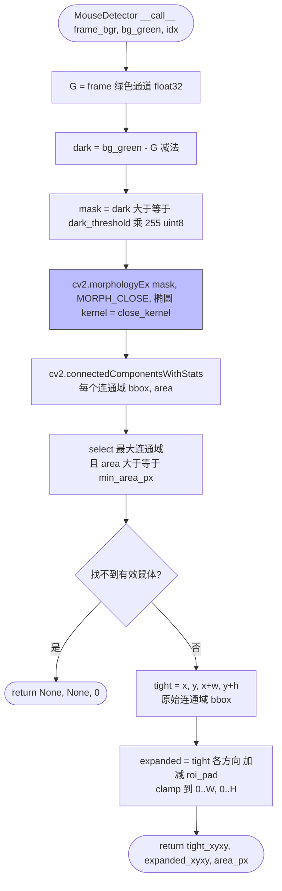

# 鼠体 ROI 检测

文件：`deepgait3/core/pawprint/mouse_detector.py`

**核心 API**：
- `MouseDetector(dark_threshold=5, close_kernel=7, min_area_px=3000, roi_pad=50)`
- `__call__(frame_bgr, bg_green, idx) -> (tight_xyxy, expanded_xyxy, area_px)` — 找不到鼠返回 `(None, None, 0)`

## 关键点

- **绿色通道减法** `dark = bg_green - G`：fTIR 走道亮、鼠体暗，差值就是鼠的剪影。
- **形态学闭运算**：椭圆 kernel 填掉鼠体内部的光斑洞。
- **连通域取最大**：只关心一只鼠；多只场景需要重新设计。
- **`roi_pad=50`**：把 tight bbox 向外扩 50 像素作为 expanded ROI，给爪印 detection 留余量。
- **失败兜底**：找不到鼠时返回 `None, None, 0`，调用方会跳过当帧 ROI 过滤（脚印全保留）。
- **零 GPU 依赖**，纯 cv2。
- **下游消费者**：[stage1-pipeline.md](stage1-pipeline.md) 中按 expanded_xyxy 过滤 footmasks。
