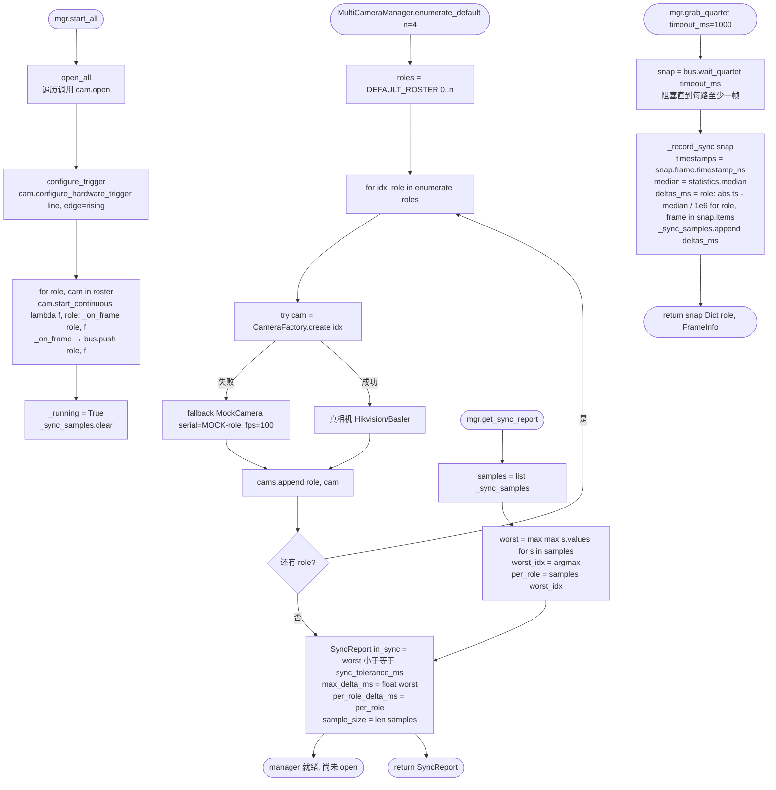
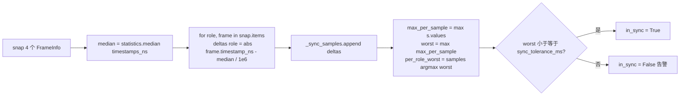
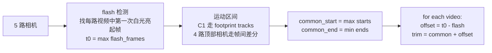

# 多相机硬件同步

文件：
- `deepgait3/hardware/camera/multi_cam.py` — `MultiCameraManager`, `FrameBus`, `SyncReport`, `MockCamera`
- `deepgait3/hardware/camera/trigger.py` — `TriggerController`, `PulseEvent`（RP2040 硬件触发，软件 fallback）
- `deepgait3/hardware/camera/base.py` — `ICamera`, `FrameInfo`, `CameraFactory`

> 当前默认 roster 为 4 路（`bottom / left / right / top`），3D 姿态走 C2/C3/C4。**5 路扩展**（C1 + 4 个 1024×1024 顶部相机）见"扩展 5 路"小节。

## 关键常量

| 名称 | 值 | 含义 |
|---|---|---|
| `SYNC_TOLERANCE_MS` | 1.0 | 帧间最大时间戳差，越界即"失同步" |
| `DEFAULT_ROSTER` | `("bottom", "left", "right", "top")` | 默认 4 路相机角色 |
| `trigger_line` | 0 (Hikvision) / 1 (Basler) | 硬件触发 GPIO 线号 |
| `queue_capacity` | 16 | `FrameBus` 每路最大缓存帧 |

## 启动 / 抓帧 / 同步检测

## 同步判定细节

## 扩展 5 路

5 路扩展主要是**增加 roster 大小**和**LED flash 同步基准**：

## 关键点

- **硬件触发是同步的根本**：`TriggerController` 驱动 RP2040 PIO 输出 100Hz 触发方波，所有相机在同一个上升沿开始曝光。
- **FrameBus 屏蔽线程细节**：消费者只需要 `wait_quartet` 拿完整 quartet，不需要自己管 slot。
- **MockCamera 提供可重复测试**：`clock_offset_ms` 注入可控制 jitter，便于单元测试 sync monitor。
- **Hikvision/Basler trigger 线号不同**：Windows Hikvision 走 Line 0，Linux Basler 走 Line 1，平台相关。
- **`SyncReport.in_sync` 判定**：worst delta ≤ `SYNC_TOLERANCE_MS` (1ms) 即算同步；超出会写日志告警。
- **扩展 5 路**：增加一个 `top_center` 或 `top_4` slot，配合 LED flash 检测做帧级对齐；5 路在 `enumerate_default(n=5)` 时生效。
- **零 Qt 依赖**，可独立运行测试。
