# Stage 1 Trial 流水线

文件：`deepgait3/core/pawprint/pipeline.py`

**核心 API**：
- `Stage1Pipeline(mouse_id, **kwargs)` — 单只鼠 trial 的 orchestrator
- `run(frame_dir, output_dir) -> TrialResult` — 主入口
- 内部 helpers: `_load_frames`, `_build_median_bg`, `_intersects`, `_save_per_print_pngs`, `_save_cumulative`

**默认参数**（`DEFAULTS`）：

| 字段 | 默认值 | 说明 |
|---|---|---|
| conf | 0.25 | YOLO 置信度 |
| min_area_px | 5 | 最小爪印面积 |
| batch_size | 16 | YOLO 批大小 |
| fps | 60.0 | 帧率 |
| px_per_mm | 1.92 | 标定比例 |
| iou_min | 0.3 | tracker IoU 阈值 |
| max_gap_frames | 3 | tracker 最大间隔 |
| min_print_frames | 2 | 至少 2 帧才算 cycle |
| mouse_dark_threshold | 5 | 鼠体暗度阈值 |
| mouse_close_kernel | 7 | 鼠体形态学闭运算核 |
| mouse_min_area_px | 3000 | 鼠体最小面积 |
| roi_pad | 50 | 鼠体 ROI 扩展 |

```mermaid
flowchart TD
    Start(["Stage1Pipeline.run frame_dir, output_dir"]) --> Load["_load_frames frame_dir\npaths = sorted frame_*.png\nframes = cv2.imread each"]
    Load --> Bg["_build_median_bg frames\ngreens = stack 绿色通道\nbg_G = np.median axis=0"]
    Bg --> Init["tracker = IoUFootprintTracker\nMouseDetector dark, close, min_area, roi_pad\nmouse_rois = 空 list"]
    Init --> Batch["for batch_start in 0..N step batch_size"]

    subgraph BatchLoop["批量 YOLO + ROI 过滤"]
        Batch --> PerMouse["for i, frame in batch_frames\nmouse_rois.append MouseRoi idx, tight, expanded, area"]
        PerMouse --> Det["detector.detect_batch batch_frames, bg_G, min_area_px"]
        Det --> Filter["for i, _, fm_list in zip\n  expanded = mouse_rois idx-1 .expanded_xyxy\n  if expanded != 0, 0, 0, 0\n    fm_list = fm for fm in fm_list if _intersects bbox, expanded"]
        Filter --> Update["tracker.update idx, fm_list"]
        Update --> NextBatch{"还有 batch?"}
        NextBatch -->|"是"| Batch
        NextBatch -->|"否"| Fin["tracks = tracker.finalize"]
    end

    Fin --> Cycles["cycles = build_cycles tracks, fps, px_per_mm, min_print_frames"]
    Cycles --> Result["TrialResult mouse_id, input_dir, num_frames, frame_size, fps, px_per_mm, roi_pad, tau_paw, mouse_rois, cycles"]
    Result --> Pngs["_save_per_print_pngs output_dir, frames, result\nper_print / cycle_XXXX_frame_XXXX.png"]
    Pngs --> DB["db_path = output_dir / footprints.db\ncreate_db + save_trial + conn.close"]
    DB --> Cum["_save_cumulative tracks, output_dir, H, W\nbuild_cumulative_union + render_overlay\n输出 cumulative_overlay.png, cumulative_mask.png"]
    Cum --> Done(["return TrialResult"])

    style BatchLoop fill:#f9f,stroke:#333,stroke-width:2px
```

## 关键点

- **YOLO 批推理 + 鼠体 ROI 过滤**：detection 后按鼠标所在 ROI 排除噪声，鼠不在的脚印不参与累计。
- **帧号 1-based**：`idx = batch_start + i + 1`，与 `IoUFootprintTracker` 约定一致。
- **`px_per_mm`** 把像素距离换算成 mm 物理单位，喂给 `build_cycles` 算 `area_mm2` 等。
- **输出三件套**：per_print PNG 裁剪图（每帧脚印图）、SQLite 数据库、cumulative overlay + mask。
- **数据契约**：`TrialResult` 的字段定义在 `core/pawprint/models.py`，下游 Stage 2/3/4 全部消费这个结构。
- **零 Qt 依赖**，CLI 直接调用：`python -m deepgait3 extract --video ...`。
