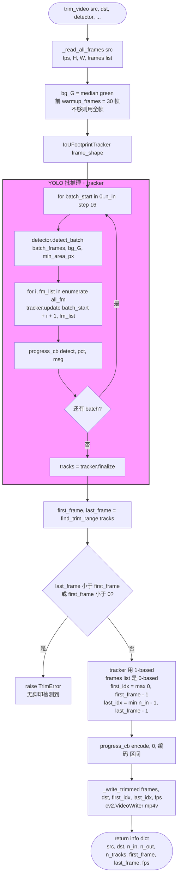
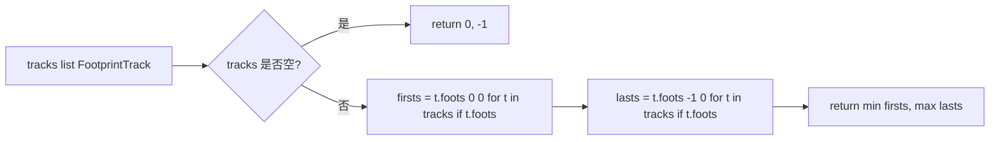

# 视频去头掐尾（Trim by Footprint）

文件：`deepgait3/core/pawprint/trim.py`

**核心 API**：
- `find_trim_range(tracks)` — 返回 `(first_frame, last_frame)` 1-based 帧号；空 tracks 返回 `(0, -1)`
- `trim_video(src, dst, *, detector, iou_min=0.3, max_gap_frames=3, min_area_px=5, warmup_frames=30, progress_cb=None)` — 重编码到 dst
- `_read_all_frames(src_path)` — 读入全部帧
- `_write_trimmed(frames, dst, first_idx, last_idx, fps)` — 写 mp4v

### `find_trim_range` 细节

## 关键点

- **复用现有 YOLO + IoU tracker**，不重新发明 detection 链路。
- **tracker 帧号 1-based**：`tracker.update(batch_start + i + 1, ...)`，`i=0` 表示 `batch_start` 对应的 0-based 帧。
- **写帧时必须 -1 转 0-based**：`first_idx = first_frame - 1`。
- **空 tracks 触发 TrimError**，让调用方决定是否忽略（不静默吃错）。
- **进度回调两阶段**：`phase="detect"` 和 `phase="encode"`，GUI 可以分别显示。
- **暖身帧数** `warmup_frames=30`：30 帧用于估计中值背景，不够则退化为全帧。
- **输出位置**：由调用方决定，默认 `projects/<name>/rawdata/videos/trimmed/<animal_id>.mp4`。
- **零 Qt 依赖**，可在 `TrimWorker` (QThread) 中调用。
