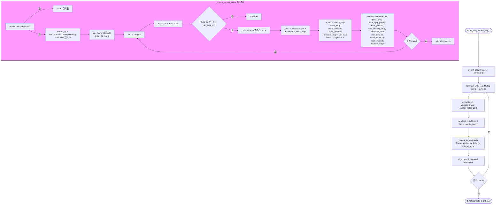

# YOLOv8n-seg 爪印检测

文件：`deepgait3/core/pawprint/yolo_detector.py`

**核心 API**：
- `YoloPawDetector(model_path, conf=0.25)` — 加载权重，conf 阈值
- `detect_single(frame, bg_G, *, min_area_px=5)` — 单帧，返回 `List[FootMask]`
- `detect_batch(frames, bg_G, *, min_area_px=5)` — 批量 16 帧，返回 `List[List[FootMask]]`
- `_results_to_footmasks(frame, results, bg_G, h, w, min_area_px)` — YOLO 输出 → FootMask 转换

## 关键点

- `detect_single` 只是 `detect_batch` 的薄包装，重活都在 `_results_to_footmasks`。
- **mask resize 走 cv2**（CPU 路径，保留与 `experiment/demo_video_gpu.py` 一致），不依赖 torch 插值。
- **背景差 `delta = G - bg_G`** 决定 `mean_intensity` 和 `pressure_map`，与 `experiment` 保持一致。
- **面积阈值** `min_area_px` 决定是否丢弃过小 mask；过小通常对应噪声。
- **bbox padding 2 像素**，给 mask 边缘留余量，避免后续 tracker 的 IoU 计算偏差。
- **BATCH_SIZE=16** 是经验值，受 RTX 3060 显存约束；如换更小的卡需下调。
- **零 Qt 依赖**，可直接 CLI 调用。
