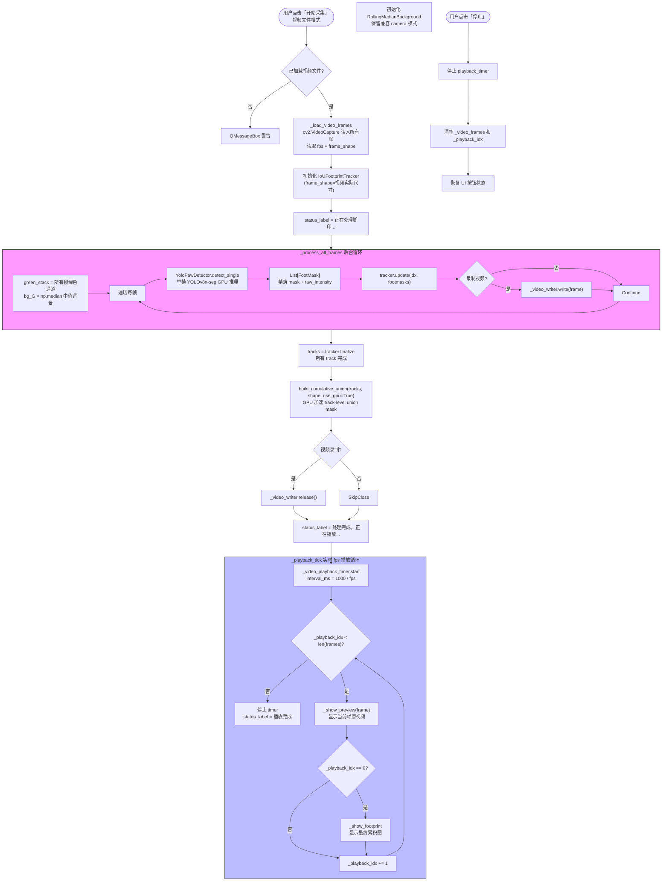
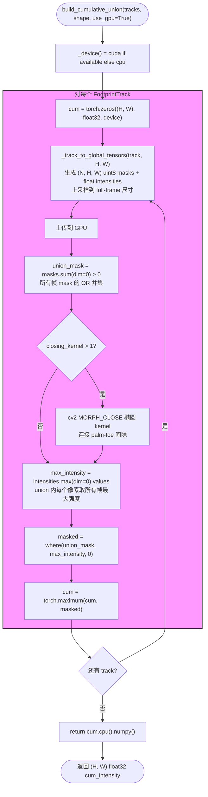
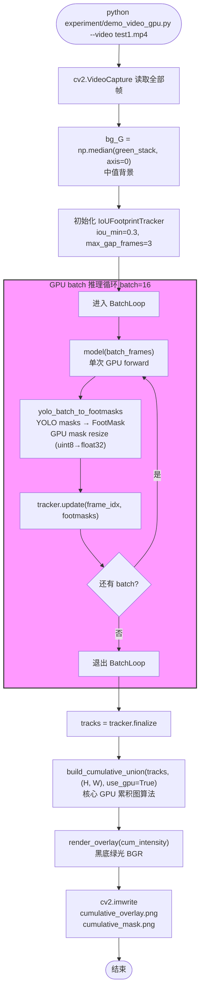
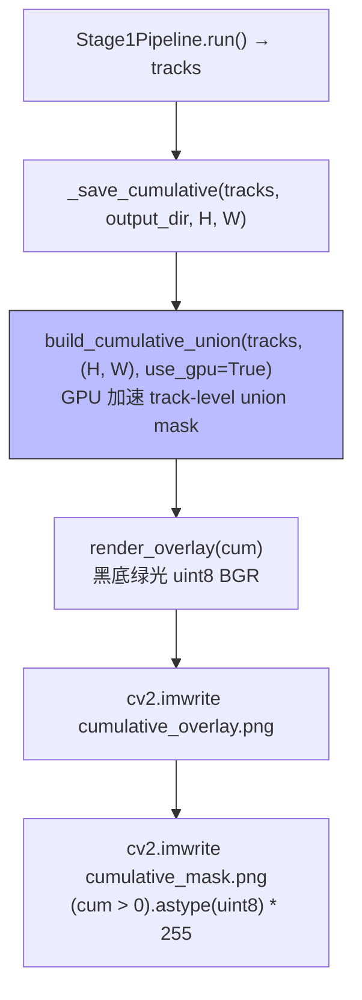

# DeepGait v3 脚印算法流程图

> ⚠️ **DEPRECATED**（2026-07-08）：本文档已迁移到 [`docs/flowchart/`](../flowchart/README.md)，按"每模块一图"重组。请到新目录查阅最新流程图。
>
> 本文件保留原因：git 历史可读性。仅供回溯参考，不再更新。
>
> **重命名提示**："新建实验" Tab 已改名为"数据采集" Tab，详见 [data-acquisition-tab.md](../flowchart/data-acquisition-tab.md)。

---

## 流程图 1：GUI「新建实验」Tab 中脚印累积图出现的过程（模式 C：先处理再播放）

> ⚠️ 此流程图描述的 mode C 已被废弃。新版数据采集 tab 不再做实时累积图渲染；累积图由 [数据分析 tab](../flowchart/data-analysis-tab.md) 负责。

文件：`deepgait3/gui/gait_experiment_tab.py`

**核心变更**（2026-07-07）：
- 视频文件模式不再"边播边处理"。改为先完整处理整个视频，构建最终累积图，然后按真实 fps 播放。
- 累积图算法升级为 **GPU 加速的 track-level union mask**（`build_cumulative_union`），不再用像素级 max-merge。

### 关键函数与文件（更新后）

| 步骤 | 文件 | 函数 | 说明 |
|------|------|------|------|
| 加载视频 | `gait_experiment_tab.py:_load_video_frames` | `_load_video_frames` | 一次性读入所有帧 |
| 后台处理 | `gait_experiment_tab.py:_process_all_frames` | `_process_all_frames` | YOLO + tracker 处理整个视频 |
| 构建累积图 | `cumulative.py` | `build_cumulative_union(tracks, shape, use_gpu=True)` | GPU 加速 track union |
| 渲染累积图 | `cumulative.py` | `render_overlay(cum_intensity)` | 黑底绿光渲染 |
| 显示累积图 | `gait_experiment_tab.py:_show_footprint` | `_show_footprint` | 缩放后显示在 QLabel |
| 播放循环 | `gait_experiment_tab.py:_playback_tick` | `_playback_tick` | 按真实 fps 播放 |

---

## 流程图 2：累积图 GPU 算法 `build_cumulative_union`

文件：`deepgait3/core/pawprint/cumulative.py`

### 关键点

- **空间维度**：每个 track 的 union mask = OR of all frame masks
- **强度维度**：union 内每个像素取所有帧中的最大强度
- **可选闭运算**：当 `closing_kernel > 1` 时，用椭圆 kernel 做 MORPH_CLOSE 连接脚掌-脚趾间隙
- **GPU 加速**：所有 per-track tensor 操作都在 GPU 上；只有 mask→numpy 上传和 (可选) 闭运算是 CPU
- **CPU 回退**：CUDA 不可用时自动用 CPU
- **零 Qt 依赖**：纯算法层，可 CLI 直接调用

---

## 流程图 3：`experiment/demo_video_gpu.py`（已升级使用 core 函数）

文件：`experiment/demo_video_gpu.py`

### 关键函数与文件（更新后）

| 步骤 | 文件 | 函数 | 说明 |
|------|------|------|------|
| 主入口 | `experiment/demo_video_gpu.py:main` | `main()` | 命令行参数 + 总流程 |
| 批量 mask 转换 | `experiment/demo_video_gpu.py:yolo_batch_to_footmasks` | `yolo_batch_to_footmasks()` | GPU resize + FootMask 构造 |
| IoU 跟踪 | `core/pawprint/tracker.py` | `IoUFootprintTracker` | 跨帧匹配 footprint |
| **累积图构建（升级）** | **`core/pawprint/cumulative.py`** | **`build_cumulative_union(tracks, shape, use_gpu=True)`** | **GPU track union** |
| **渲染叠加（升级）** | **`core/pawprint/cumulative.py`** | **`render_overlay()`** | **黑底绿通道显示** |
| 输出文件 | `experiment/demo_video_gpu.py` | `cv2.imwrite` | `cumulative_overlay.png` |

---

## 流程图 4：`core/pawprint/pipeline.py` 的 `_save_cumulative`（已升级）

---

## 三个调用点对照

| 调用点 | 累积图算法 | GPU 加速 | 状态 |
|--------|-----------|----------|------|
| `core/pawprint/pipeline.py:_save_cumulative` | `build_cumulative_union` | ✅ | ✅ 已升级 |
| `experiment/demo_video_gpu.py` (main) | `build_cumulative_union` | ✅ | ✅ 已升级 |
| `gui/gait_experiment_tab.py` (mode C) | `build_cumulative_union` | ✅ | ✅ 已升级 |

## 升级前后的对比

| 维度 | 旧算法 | 新算法 (track union) |
|------|--------|---------------------|
| 空间维度 | 像素级 max-merge（跨所有 track） | 每 track 先 OR mask，再 max-merge |
| 噪声处理 | 孤立 detection 也参与 max-merge | 只对稳定 track 累积（更干净） |
| 强度来源 | 来自任意一帧的最大强度 | 来自 track 内某一帧的最大强度 |
| GPU 加速 | 否 | ✅ |
| 算法一致性 | 分散在三处 | 统一在 `core/pawprint/cumulative.py` |

## 验证

升级后的输出与实验脚本输出**像素级完全一致**（diff max = 0），共 39 tracks / 327 detections / 133 帧 / 7.1s。

---

## 待确认/修改的点

1. **GUI 相机模式**：目前保留旧的实时累加路径。如果相机也想改成 mode C（先存帧再处理），需要重新设计。
2. **形态学闭运算**：当前 `closing_kernel=None` 默认关闭。需要时可以打开测试。
3. **是否在 core 里加一个 `CumulativeBuilder` 状态对象**，让相机模式也能逐帧增量累积（而不必等所有帧处理完）？

改完后告诉我即可。